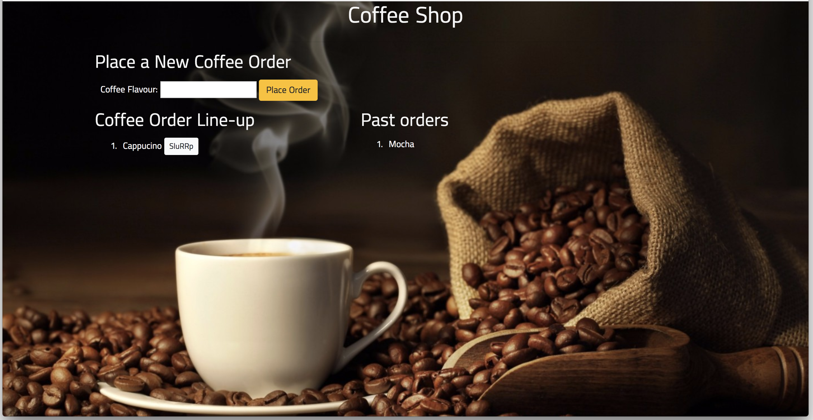

# SEQUELized-Coffee-shop
## Getting started
This is a Coffee Shop logger app with MySQL, Node, Express, Handlebars and Sequelize, which follows the MVC design pattern: 
Node and Sequelize to query and route data in the app and Handlebars to generate HTML.

### Pre-requisites
* Coffee Shop is a restaurant app that lets users input the names of coffee they'd like to drink
* Whenever a user submits a coffee name, the app will display the coffee on the left side of the page -- waiting to be finished
* Each coffee in the waiting area also has a Slurrp button. When the user clicks it, the coffee will move to the right side of the page.
* The app will store every coffee in a database, whether finished drinking or not
        
* Heroku is used for hosting the application
* Jaws DB as an external, web database

#### A Preview of the App

#### Installation
* NodeJs
* Node package modules for sequelize,express,express-handlebars,body-parser,mysql2
